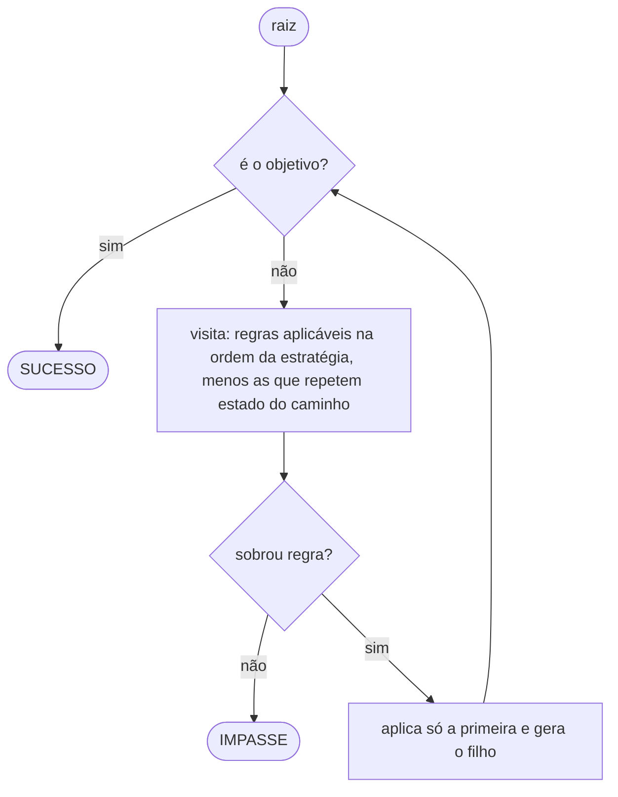
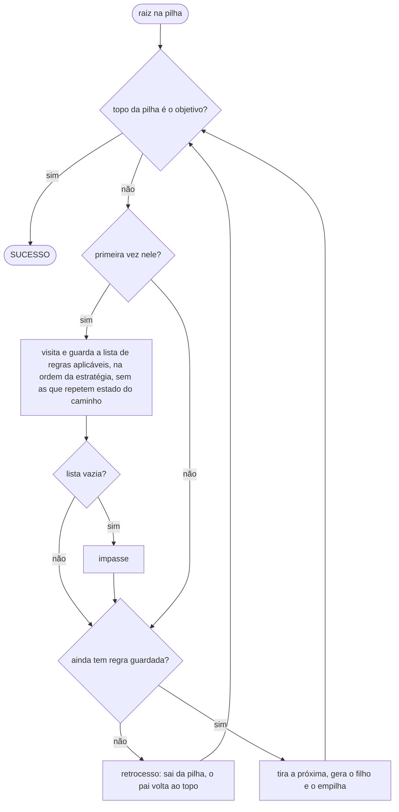
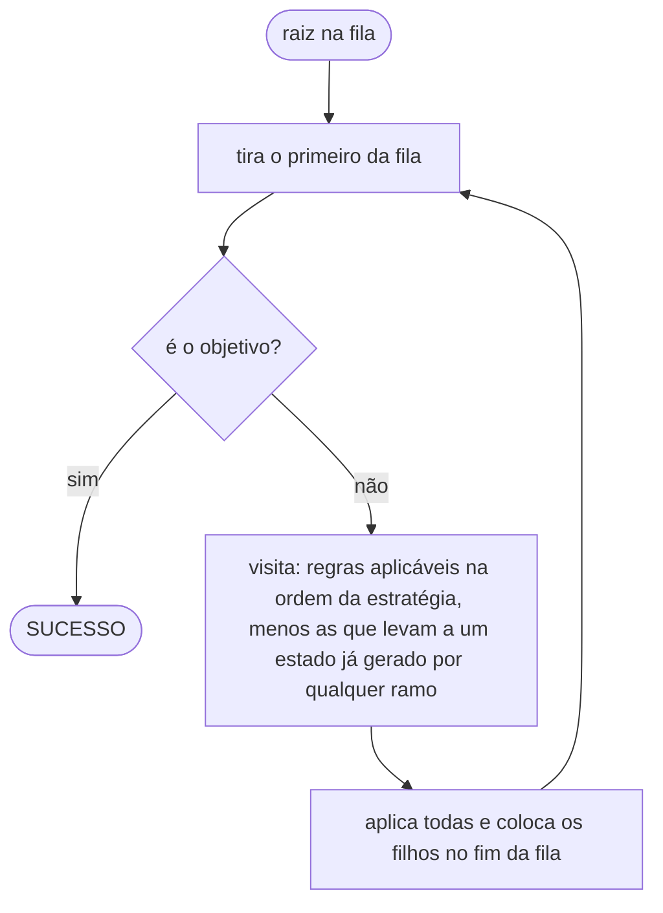

# Torre de Londres

Resolvedor do problema da Torre de Londres (3 hastes, 3 discos) com busca irrevogável, backtracking e busca em largura sobre uma mesma abstração de árvore de busca, com estratégia de controle parametrizável, métricas instrumentadas e placar comparativo.

Python 3.12+, zero dependências de runtime.

Trabalho 1 da disciplina DCC014 (Inteligência Artificial) da Universidade Federal de Juiz de Fora, ministrada pela professora Luciana.

## Grupo 5

| Integrante | Matrícula |
|---|---|
| Charles Lelis Braga | 202035015 |
| Darlan Henrique da Costa Silva | 202176038 |
| Isaac Dizolele Kapela João | 202376017 |
| Fábio do Vale Affonso | 202076021 |
| Felipe Iglesias Cordeiro Leite | 202465031AB |
| Rafaela Oliveira de Souza | 202365133C |
| Rian Cesar Quintanilha | 202465080AC |
| Gustavo Dias de Almeida | 202165571C |
| Larissa Rezende Fazza | 202335021 |
| Ian Félix Fernandes | 202376007 |
| Michel Gomes de Andrade | 201876037 |

## Instalação

```bash
make install
```

## Uso

```bash
python main.py                      # tudo: cada eixo omitido significa "todos"
python main.py --list               # cartas, algoritmos e estratégias disponíveis
python main.py --problem P1
python main.py --algorithm backtracking --strategy descending
python main.py --algorithm backtracking --show-tree --show-trace
python main.py --show-states
python main.py --strategy custom --order R2,R4,R6,R1,R3,R5
python main.py --rank-mode score
python main.py --format json --output resultados.json
python main.py --svg-dir data          # árvore de cada execução em data/<carta>/<algoritmo>_<estratégia>.svg
python main.py --help
```

## Estrutura

```
src/
├── core/                      problema e motor
│   ├── rules/
│   │   ├── domain/            tipos, restrições, catálogo, erros
│   │   ├── moves.py           R1..R6
│   │   └── strategies/
│   │       ├── domain/        contrato e registro
│   │       ├── ascending.py
│   │       ├── descending.py
│   │       └── custom_order.py
│   ├── domain/                estados, invariantes, cartas, enumeração
│   ├── search_tree/           nó, árvore, fronteira, caminho, métricas, trace
│   └── algorithms/
│       ├── domain/            contrato e registro
│       ├── irrevocable.py
│       ├── backtracking.py
│       └── breadth_first.py
├── libs/                      bibliotecas de borda
│   ├── inputs/                linha de comando → requisição validada
│   ├── outputs/               única camada que escreve no terminal e em disco
│   └── ranking/               placar por carta e resumo consolidado
├── runner/                    orquestração; conhece todas as outras camadas
└── config/                    limites, padrões e textos da interface
```

Duas convenções sustentam a leitura da árvore:

- **Uma pasta no plural contém apenas implementações.** `algorithms/` tem três arquivos, um por algoritmo. O contrato e o registro de cada família vivem num `domain/` interno.
- **Não há `__init__.py`.** O que cada camada é fica documentado aqui e nos ADRs, e é verificado por teste, não por um arquivo vazio em cada pasta.

### Regra de dependência

```
core/rules/  ←  core/  ←  runner/  →  libs/
```

- `core/rules/` não importa nada do projeto fora do próprio pacote.
- `core/` não conhece `libs/` nem `runner/`.
- `core/search_tree/` não conhece `core/algorithms/`.
- Nenhum `print` existe fora de `libs/outputs/`.
- Todo módulo direto de `algorithms/` e de `strategies/` declara uma implementação registrada.

Tudo isso é verificado na AST por [tests/architecture/test_dependencies.py](tests/architecture/test_dependencies.py), não por convenção.

## Convenções

- Código inteiramente em inglês.
- **Sem comentários e sem docstrings de função.** O contrato de cada função é a assinatura tipada, garantida por `mypy --strict`. Só diretivas de ferramenta (`# noqa`, `# type:`) aparecem no meio do código.
- **A modelagem do problema é documentada no topo dos módulos que a carregam**, e só neles: [problem.py](src/core/domain/problem.py) (posição inicial e catálogo de cartas), [state_space.py](src/core/domain/state_space.py) (os 36 estados, conexidade, o oráculo) e os três algoritmos, cada um com a execução de P1 resolvida passo a passo, listas ABERTOS e FECHADOS, árvore de busca e caminho solução.
- Estado imutável em todo lugar: `tuple`, frozen dataclass, enum.
- Texto apresentado ao usuário só em `libs/outputs/theme.py` e `config/settings.py`.

## Algoritmos

Os três compartilham o motor: `visita` conta e registra o vértice, `gera` cria um filho pela regra, `poda` descarta a regra cujo sucessor repetiria um estado. Estourar o limite de iterações encerra qualquer um deles com LIMITE. O que muda é a fronteira e a decisão em cada vértice.

### Busca irrevogável

Um caminho só. A regra preferida da estratégia é aplicada e as outras são esquecidas.



Sempre para, no máximo depois dos 36 estados, porque nunca repete estado no caminho. É o único método em que a estratégia muda o desfecho: em P1, `descending` trava na 3ª iteração e `ascending` chega em 14 movimentos.

### Backtracking

A mesma descida, com as alternativas de cada vértice guardadas numa pilha. Travou, volta ao ancestral mais próximo que ainda tem alternativa.



Impasse vira desvio e a solução sempre aparece, mas é a primeira encontrada, não a mais curta. Em P1 com `descending`: 51 iterações, 14 retrocessos, 22 movimentos para um ótimo de 3.

### Busca em largura

Não escolhe regra: aplica todas, os filhos esperam numa fila e a árvore é varrida por níveis.



Nada de profundidade d+1 antes de esgotar d, então o primeiro caminho até um estado é o mais curto. O objetivo encontrado é o ótimo, e por isso este método é a referência dos outros dois. A poda aqui é global: um estado descoberto por qualquer ramo nunca é gerado de novo. Em P1: R4, R1, R1, 3 movimentos em 12 iterações.

## Qualidade

```bash
make check     # ruff + mypy --strict + pytest com cobertura mínima de 95%
make test
make lint
make types
make run
make clean
```

## Árvores de busca em SVG

`make graphs` grava em `data/` um `.dot` e um `.svg` por execução, com o caminho solução em azul, o objetivo em verde, os impasses em vermelho e as regras podadas em pontilhado. O `.dot` é gerado pelo projeto; o `.svg` vem do Graphviz (`dot`), que precisa estar instalado. Sem ele, só o `.dot` é gravado e um aviso aparece.

```bash
sudo apt install graphviz     # ou: brew install graphviz
make graphs
```

## Documentação

- [SPEC.md](SPEC.md): especificação técnica completa.
- [src/core/domain/state_space.py](src/core/domain/state_space.py): contagem dos 36 estados, propriedades do grafo e o papel de oráculo.
- [src/core/algorithms/](src/core/algorithms/): cada algoritmo traz a execução de P1 resolvida passo a passo, com árvore de busca e caminho solução, tudo tirado do `--show-trace`. Os fluxogramas em Mermaid estão na seção Algoritmos acima.

`docs/` existe no disco mas está fora do versionamento.
