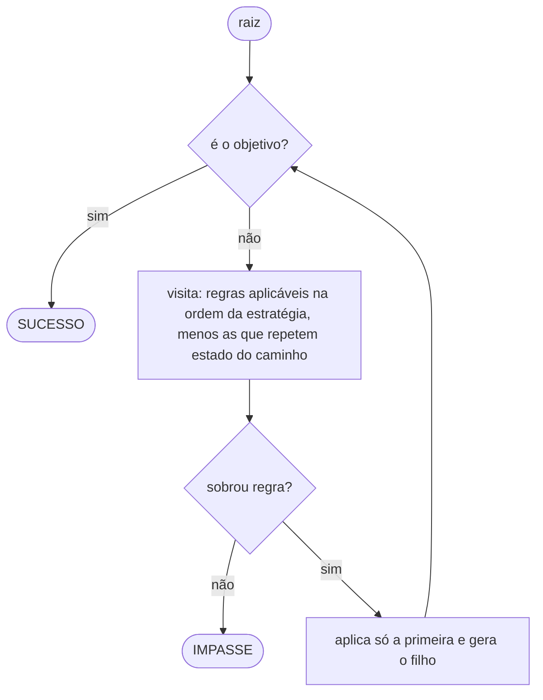
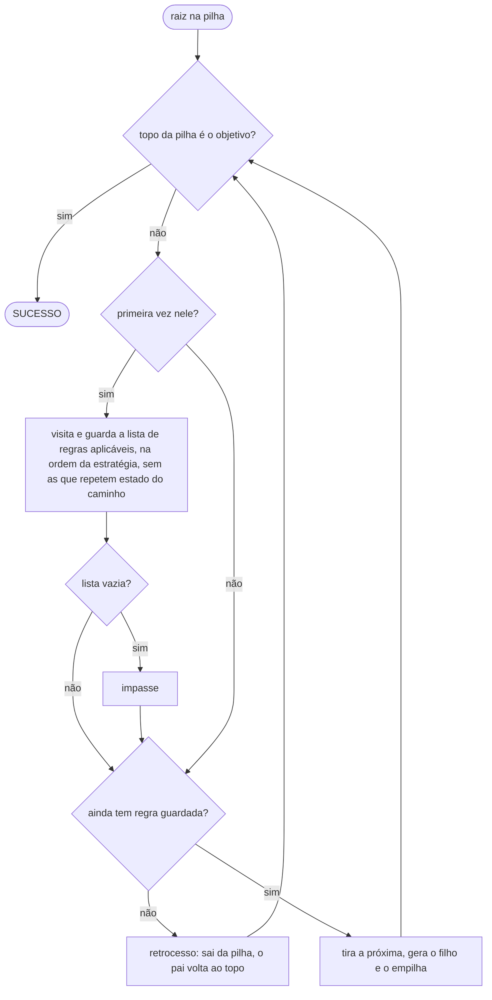
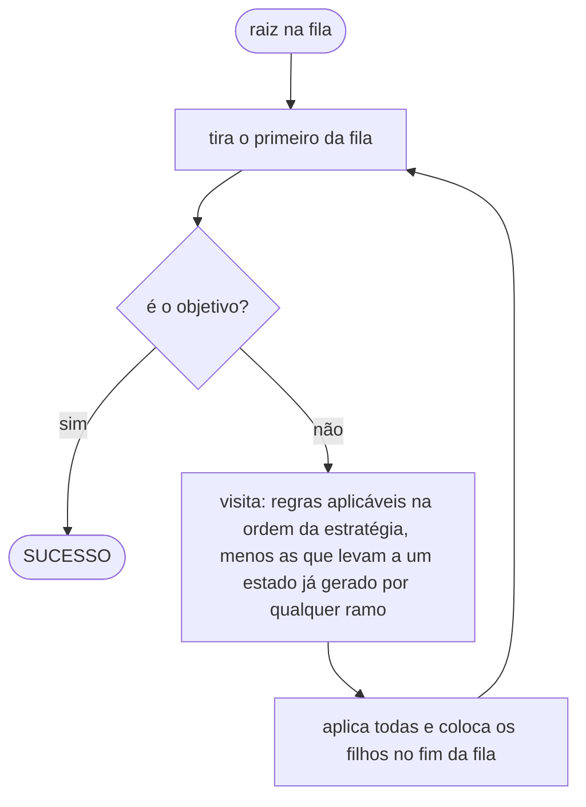
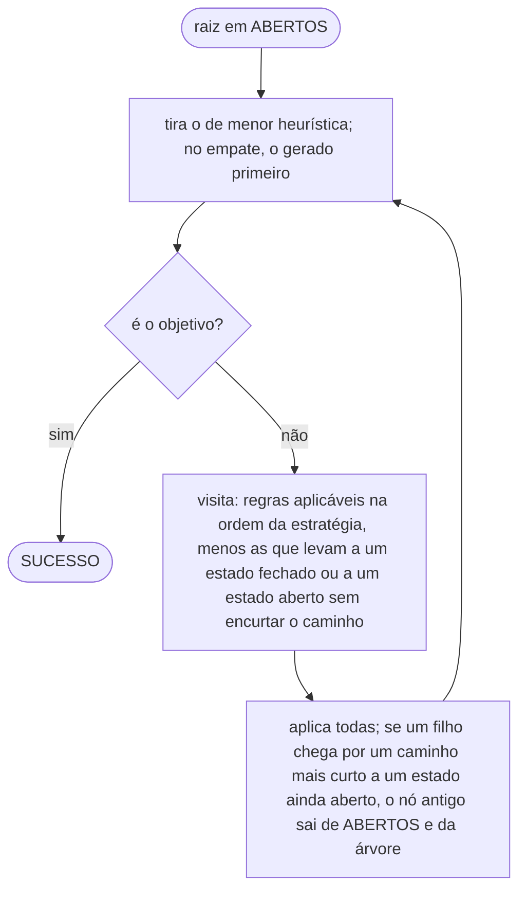
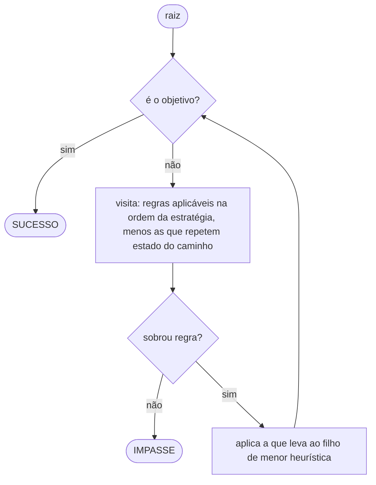

# Torre de Londres

Resolvedor do problema da Torre de Londres (3 hastes, 3 discos) com busca irrevogável, backtracking, busca em largura, busca ordenada e busca gulosa sobre uma mesma abstração de árvore de busca, com estratégia de controle parametrizável, métricas instrumentadas e placar comparativo.

Python 3.12+, zero dependências de runtime.

Trabalho 1 da disciplina DCC014 (Inteligência Artificial) da Universidade Federal de Juiz de Fora, ministrada pela professora Luciana.

## Grupo 5

| Integrante | Matrícula |
|---|---|
| Charles Lelis Braga | 202035015 |
| Darlan Henrique da Costa Silva | 202176038 |
| Isaac Dizolele Kapela João | 202376017 |
| Fábio do Vale Affonso | 202076021 |
| Felipe Iglesias Cordeiro Leite | 202465031AB |
| Rafaela Oliveira de Souza | 202365133C |
| Rian Cesar Quintanilha | 202465080AC |
| Gustavo Dias de Almeida | 202165571C |
| Larissa Rezende Fazza | 202335021 |
| Ian Félix Fernandes | 202376007 |
| Michel Gomes de Andrade | 201876037 |

## Instalação

```bash
make install
```

## Uso

```bash
python main.py                      # tudo: cada eixo omitido significa "todos"
python main.py --list               # cartas, algoritmos e estratégias disponíveis
python main.py --problem P1
python main.py --algorithm backtracking --strategy descending
python main.py --algorithm backtracking --show-tree --show-trace
python main.py --show-states
python main.py --rank-mode score
python main.py --all-goals             # os 36 estados finais; só o resumo, com média e mediana
python main.py --no-prune              # sem poda: a árvore aceita estados repetidos
python main.py --format json --output resultados.json
python main.py --svg-dir data          # árvore de cada execução em data/<carta>/<algoritmo>_<estratégia>.svg
python main.py --help
```

## Estrutura

```
src/
├── core/                      problema e motor
│   ├── rules/
│   │   ├── domain/            tipos, restrições, catálogo, erros
│   │   ├── moves.py           R1..R6
│   │   └── strategies/
│   │       ├── domain/        contrato e registro
│   │       └── canonical.py   ascending e descending
│   ├── domain/                estados, invariantes, cartas, enumeração
│   ├── search_tree/           nó, árvore, contrato da fronteira, caminho, métricas, trace
│   └── algorithms/
│       ├── domain/            contrato e registro
│       ├── irrevocable/       algorithm.py
│       ├── backtracking/      algorithm.py + frontier.py (pilha)
│       ├── breadth_first/     algorithm.py + frontier.py (fila)
│       ├── ordered/           algorithm.py + frontier.py (fila pela heurística)
│       └── greedy/            algorithm.py
├── libs/                      bibliotecas de borda
│   ├── inputs/                linha de comando → requisição validada
│   ├── outputs/               única camada que escreve no terminal e em disco
│   └── ranking/               placar por carta e resumo consolidado
├── runner/                    orquestração; conhece todas as outras camadas
└── config/                    limites, padrões e textos da interface
```

Duas convenções sustentam a leitura da árvore:

- **Uma pasta no plural contém apenas implementações.** `algorithms/` tem uma pasta por algoritmo, com o laço (`algorithm.py`) e a fronteira que ele usa (`frontier.py`) lado a lado. O contrato e o registro de cada família vivem num `domain/` interno.
- **Não há `__init__.py`.** O que cada camada é fica documentado aqui e nos ADRs, e é verificado por teste, não por um arquivo vazio em cada pasta.

### Regra de dependência

```
core/rules/  ←  core/  ←  runner/  →  libs/
```

- `core/rules/` não importa nada do projeto fora do próprio pacote.
- `core/` não conhece `libs/` nem `runner/`.
- `core/search_tree/` não conhece `core/algorithms/`.
- Nenhum `print` existe fora de `libs/outputs/`.
- Todo `algorithm.py` de `algorithms/` e todo módulo direto de `strategies/` declara uma implementação registrada.

Tudo isso é verificado na AST por [tests/architecture/test_dependencies.py](tests/architecture/test_dependencies.py), não por convenção.

## Convenções

- Código inteiramente em inglês.
- **Sem comentários e sem docstrings de função.** O contrato de cada função é a assinatura tipada, garantida por `mypy --strict`. Só diretivas de ferramenta (`# noqa`, `# type:`) aparecem no meio do código.
- **A modelagem do problema é documentada no topo dos módulos que a carregam**, e só neles: [problem.py](src/core/domain/problem.py) (posição inicial e catálogo de cartas), [state_space.py](src/core/domain/state_space.py) (os 36 estados, conexidade, o oráculo) [heuristic.py](src/core/domain/heuristic.py) (a heurística) e os cinco algoritmos, cada um com a carta P1 e o critério de busca.
- Estado imutável em todo lugar: `tuple`, frozen dataclass, enum.
- Texto apresentado ao usuário só em `libs/outputs/theme.py` e `config/settings.py`.

## Algoritmos

Os cinco compartilham o motor: `visita` conta e registra o vértice, `gera` cria um filho pela regra, `poda` descarta a regra cujo sucessor repetiria um estado. Estourar o limite de iterações encerra qualquer um deles com LIMITE. O que muda é a fronteira e a decisão em cada vértice.

### Busca irrevogável

Um caminho só. A regra preferida da estratégia é aplicada e as outras são esquecidas.


```mermaid
flowchart TD
    A([raiz]) --> B{é o objetivo?}
    B -- sim --> S([SUCESSO])
    B -- não --> C[visita: regras aplicáveis na ordem da estratégia, menos as que repetem estado do caminho]
    C --> D{sobrou regra?}
    D -- não --> X([IMPASSE])
    D -- sim --> E[aplica só a primeira e gera o filho]
    E --> B
```

Sempre para, no máximo depois dos 36 estados, porque nunca repete estado no caminho. É o único método em que a estratégia muda o desfecho: em P1, `descending` trava na 3ª iteração e `ascending` chega em 14 movimentos.

### Backtracking

A mesma descida, com as alternativas de cada vértice guardadas numa pilha. Travou, volta ao ancestral mais próximo que ainda tem alternativa.


```mermaid
flowchart TD
    A([raiz na pilha]) --> B{topo da pilha é o objetivo?}
    B -- sim --> S([SUCESSO])
    B -- não --> C{primeira vez nele?}
    C -- sim --> V[visita e guarda a lista de regras aplicáveis, na ordem da estratégia, sem as que repetem estado do caminho]
    V --> W{lista vazia?}
    W -- sim --> I[impasse]
    W -- não --> D
    I --> D
    C -- não --> D{ainda tem regra guardada?}
    D -- não --> R[retrocesso: sai da pilha, o pai volta ao topo]
    R --> B
    D -- sim --> E[tira a próxima, gera o filho e o empilha]
    E --> B
```

Impasse vira desvio e a solução sempre aparece, mas é a primeira encontrada, não a mais curta. Em P1 com `descending`: 51 iterações, 14 retrocessos, 22 movimentos para um ótimo de 3.

### Busca em largura

Não escolhe regra: aplica todas, os filhos esperam numa fila e a árvore é varrida por níveis.


```mermaid
flowchart TD
    A([raiz na fila]) --> B[tira o primeiro da fila]
    B --> C{é o objetivo?}
    C -- sim --> S([SUCESSO])
    C -- não --> V[visita: regras aplicáveis na ordem da estratégia, menos as que levam a um estado já gerado por qualquer ramo]
    V --> E[aplica todas e coloca os filhos no fim da fila]
    E --> B
```

Nada de profundidade d+1 antes de esgotar d, então o primeiro caminho até um estado é o mais curto. O objetivo encontrado é o ótimo em número de movimentos, e por isso este método é a referência dos outros em comprimento. Como toda jogada custa 1, também é a referência em custo. A poda aqui é global: um estado descoberto por qualquer ramo nunca é gerado de novo. Em P1: R4, R1, R1, 3 movimentos em 12 iterações.

### Heurística

Toda jogada custa 1. A busca ordenada e a gulosa usam a heurística de discos mal posicionados ([core/domain/heuristic.py](src/core/domain/heuristic.py)). Cada disco contribui com o mínimo de movimentos que ainda precisa fazer:

| disco | contribui |
|---|---|
| bem posicionado: haste e altura certas, e tudo abaixo dele também | 0 |
| em outra haste | 1 |
| na haste certa, mas mal posicionado | 2 |

**h(estado)** é a soma dos três discos. Estar na haste certa fora do lugar pesa mais que estar na haste errada, porque o disco precisa sair e voltar. A heurística é admissível: cada movimento leva um disco só, então h nunca passa do número de movimentos que falta. Os testes verificam isso nos 1.296 pares de estados.

### Busca ordenada

ABERTOS vira uma fila ordenada pela menor heurística.


```mermaid
flowchart TD
    A([raiz em ABERTOS]) --> B[tira o de menor heurística; no empate, o gerado primeiro]
    B --> C{é o objetivo?}
    C -- sim --> S([SUCESSO])
    C -- não --> V[visita: regras aplicáveis na ordem da estratégia, menos as que levam a um estado fechado ou a um estado aberto sem encurtar o caminho]
    V --> E[aplica todas; se um filho chega por um caminho mais curto a um estado ainda aberto, o nó antigo sai de ABERTOS e da árvore]
    E --> B
```

O objetivo só encerra a busca quando vira o estado atual, não quando é gerado. A estratégia só desempata irmãos de mesma heurística. Ordenar só por h não garante o caminho mais curto: nos 36 objetivos, a ordenada acha o mínimo de movimentos em 34 com `ascending` e em 33 com `descending`. Como FECHADOS impede repetir estado, ela sempre encontra uma solução. Em P1: R4, R1, R1 em 4 iterações.

### Busca gulosa

A descida da irrevogável, mas a regra aplicada é a que leva ao filho de menor heurística. A estratégia só desempata filhos de mesma heurística.


```mermaid
flowchart TD
    A([raiz]) --> B{é o objetivo?}
    B -- sim --> S([SUCESSO])
    B -- não --> C[visita: regras aplicáveis na ordem da estratégia, menos as que repetem estado do caminho]
    C --> D{sobrou regra?}
    D -- não --> X([IMPASSE])
    D -- sim --> E[aplica a que leva ao filho de menor heurística]
    E --> B
```

Gera um nó por passo, mas sem fronteira não desfaz uma escolha ruim. Nos 36 objetivos, trava em 7 com `ascending` e em 8 com `descending`. Em P1: R4, R1, R1 em 4 iterações e 4 nós gerados.

## Comparação em todos os objetivos

Uma carta só não diz qual método é melhor. `--all-goals` resolve cada um dos 36 estados do espaço como objetivo, sempre a partir da mesma posição inicial (cartas G01 a G36), com todo algoritmo e toda estratégia. A saída é só o resumo consolidado:

- **Resumo**: para movimentos, custo, iterações e nós gerados, a média e a mediana de cada combinação. Movimentos e custo contam só os sucessos.
- **Melhor por critério**: o menor valor pela média e pela mediana. Só concorre quem tem o maior número de sucessos, para a irrevogável e a gulosa não vencerem resolvendo apenas os objetivos fáceis.

O resultado: a largura vence em movimentos (média 4,14; a ordenada fica em 4,19 e 4,25). A ordenada vence em iterações e em nós gerados: 7,44 iterações em média, contra 18,5 da largura. Com custo 1 por jogada, a coluna de custo repete a de movimentos. [tests/properties/test_all_goals.py](tests/properties/test_all_goals.py) verifica tudo isso.

## Qualidade

```bash
make check     # ruff + mypy --strict + pytest com cobertura mínima de 95%
make test
make lint
make types
make run
make clean
```

## Árvores de busca em SVG

`make graphs` grava em `data/` um `.dot` e um `.svg` por execução, com o caminho solução em azul, o objetivo em verde, os impasses em vermelho e as regras podadas em pontilhado. O `.dot` é gerado pelo projeto; o `.svg` vem do Graphviz (`dot`), que precisa estar instalado. Sem ele, só o `.dot` é gravado e um aviso aparece.

```bash
sudo apt install graphviz     # ou: brew install graphviz
make graphs
```

## Notebooks para o Colab

`apps/notebook/` gera a apresentação num notebook. Cada seção de algoritmo segue a ordem dos slides (problema, ideia, laço e listas, regras, estratégia, árvore sem e com poda, pseudocódigo com o código do projeto, caminho solução, comparativos e complexidade). O que é código e não está nos slides, como o Setup, vem marcado com (ignore). O notebook é gerado a partir de `src/` e roda sozinho no Colab, sem clonar o repositório. Veja [apps/notebook/README.md](apps/notebook/README.md).

Destaques:

- **Tabela contra os outros algoritmos** com o vencedor de cada critério (nível da solução, iterações, nós gerados e expandidos, pico de ABERTOS, retrocessos, impasses) em verde.
- **A heurística na busca ordenada**: a regra dos discos mal posicionados, o código de `heuristic.py`, a conta de h em S0 disco a disco e a h de cada filho da raiz.
- **Comparativo nos 36 objetivos** na seção da ordenada: boxplot e quartis de nós expandidos, iterações e nós gerados, para todas as combinações de algoritmo e estratégia.
- **Tabelas de complexidade** com o algoritmo na primeira coluna, no mesmo formato da tabela consolidada da comparação.

```bash
make notebooks
```

## Documentação

- [SPEC.md](SPEC.md): especificação técnica completa.
- [src/core/domain/state_space.py](src/core/domain/state_space.py): contagem dos 36 estados, propriedades do grafo e o papel de oráculo.
- [src/core/algorithms/](src/core/algorithms/): cada algoritmo traz a execução de P1 resolvida passo a passo, com árvore de busca e caminho solução, tudo tirado do `--show-trace`. Os fluxogramas em Mermaid estão na seção Algoritmos acima.

`docs/` existe no disco mas está fora do versionamento.
